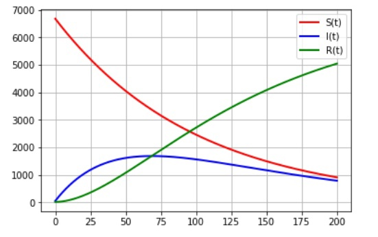

---
## Front matter
lang: ru-RU
title: Задача об эпидемии
author: Назарьева Алена НФИбд-03-18
institute:
	inst RUDN University, Moscow, Russian Federation
date: 2021, 14 march
## Formatting
toc: false
slide_level: 2
theme: metropolis
header-includes:
 - \metroset{progressbar=frametitle,sectionpage=progressbar,numbering=fraction}
 - '\makeatletter'
 - '\beamer@ignorenonframefalse'
 - '\makeatother'
aspectratio: 43
section-titles: true
---
# Цель работы

Изучить и реализовать Задачу об эпидемии

# Задание
На одном небольшом острове вспыхнула эпидемия свинки. Известно, что из
всех проживающих на острове (N=6730) в момент начала эпидемии (t=0) число
заболевших свинкой людей (являющихся распространителями инфекции) I(0)=46,
А число здоровых людей с иммунитетом к болезни R(0)=8. Таким образом, число
людей восприимчивых к болезни, но пока здоровых, в начальный момент времени
S(0)=N-I(0).
Постройте графики изменения числа особей в  каждой из трех групп. Рассмотрите, как будет протекать эпидемия в случае:
а) если I(0)<=I*
б) если I(0)>I*

# Выполнение лабораторной работы

## 1)
Код в python для I(0)<=I* (рис. -@fig:001)

{ #fig:001 width=70% }

## 2)
Динамика изменения числа людей в каждой из трех групп в случае, когда I(0)<=I* (рис. -@fig:002)

{ #fig:002 width=70% }

## 3)
Код в python для I(0)>I* (рис. -@fig:003)

{ #fig:003 width=70% }

## 4)
Динамика изменения числа людей в каждой из трех групп в случае,
когда I(0)>I* (рис. -@fig:004)

{ #fig:004 width=70% }

# Выводы

В результате проделанной работы я изучила и реализовала Задачу об эпидемии
